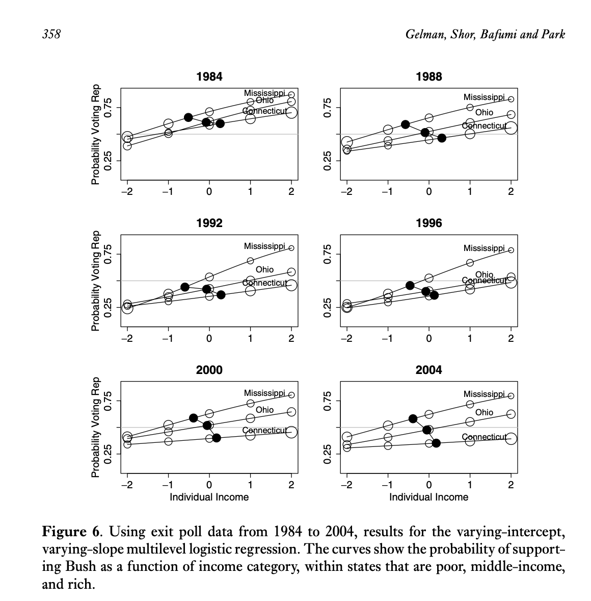
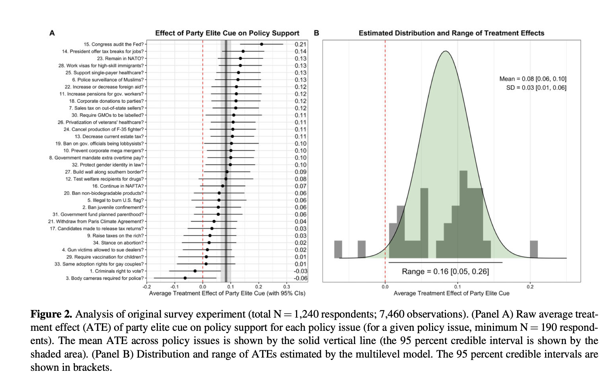

# Opening Comments

-   Workshop
    -   When would be a good week for **rehearsals** and **workshops**? I'm going to be giving RIBC students extra credit to attend.
-   Paper

```{r echo=FALSE}
#| message: false
#| warning: false
options(width = 90)
options(digits = 3)

library(tidyverse)
theme_set(theme_minimal())
```

------------------------------------------------------------------------

Here are the packages we're using:

```{r}
#| message: false
#| warning: false
#| cache: false

# generally useful packages
library(tidyverse)
library(marginaleffects)
library(modelsummary)

# for fitting hierarchical models
library(lme4)
library(brms)  # see also rstanarm::stan_lmer()
library(rstan)

# for post-processing simulations
library(tidybayes)

# preferred order (most preferred first):
library(conflicted)
conflict_prefer_all("dplyr", quiet = TRUE) 
conflict_prefer_all("tidyr", quiet = TRUE)
conflict_prefer_all("tidybayes", quiet = TRUE) 
conflict_prefer_all("brms", quiet = TRUE)
conflict_prefer_all("rstan", quiet = TRUE)
conflict_prefer_all("patchwork", quiet = TRUE)  
```

# Rich State, Poor State, Red State, Blue State

## Variables

-   `state_name`: U.S. state name joined from state_income by FIPS state_code.

-   `state_median_income` State median household income (in thousands of 2024 dollars) from state_income. Example: `92.1` = \$92,100.

-   `rs_state_median_income`: Rescaled version of state_median_income using arm::rescale() (mean 0, SD 0.5).; i.e.,

-   `income`: Numeric scores corresponding to income brackets so that (1) higher numeric values indicate higher household income and (2) the middle is zero.

    | ANES Category | Income Range (2024 USD) | Recode |
    |---------------|-------------------------|--------|
    | 1             | Under \$9,999           | −2.5   |
    | 2             | \$10,000–\$29,999       | −1.5   |
    | 3             | \$30,000–\$59,999       | −0.5   |
    | 4             | \$60,000–\$99,999       | 0.5    |
    | 5             | \$100,000–\$249,999     | 1.5    |
    | 6             | \$250,000 or more       | 2.5    |

-   `vote_rep`: 0/1 indicator of voting for the Republican candidate Donald Trump. Derived from ANES presidential vote V242067 after filtering to major-party voters only.

## Results

```{r}
#| message: false
#| warning: false
# load data
anes <- read_csv("data/red-state.csv") |>
  glimpse()

# formula
f <- vote_rep ~ rs_state_median_income*income + (1 + income | state_name)
```

Fit model.

```{r}
#| message: false
#| warning: false
#| label: "red-states"
#| cache: true
#| code-fold: true
#| results: hide
# fit hierarchical model
fit <- brm(
  f,
  data = anes,
  family = bernoulli, 
  chains = 10, 
  cores = 10, 
  iter = 1000
)
```

Use `predictions()` to generate

$$ 
E(\text{Vote R} \mid \text{Individual Income}, \text{State Income}).
$$

```{r}
#| message: false
#| warning: false
#| label: "red-states-wrangle"
#| cache: false
#| code-fold: true
# state values 
states <- anes %>%
  dplyr::select(state_name, state_median_income, rs_state_median_income) %>%
  distinct() %>%
  glimpse()

# expected values
grid <- crossing(state_name = unique(anes$state_name)) |>
  left_join(states) |>
  mutate(income = NA) |>
  glimpse()
p <- predictions(fit, 
                 variables = list(income = unique),
                 newdata = grid) |>
  left_join(states) |>
  mutate(state_name = reorder(state_name, rs_state_median_income))
```

## Plotting the estimates

What's going on here?

::::: columns
::: column

:::

::: column
```{r}
#| fig-asp: 1.3
#| fig-width: 8
#| code-fold: true
ggplot(p, aes(x = income, y = estimate, group = state_name, color = state_median_income)) + 
  geom_line() + 
  labs(x = "Income Category", 
       y = "Probability of Voting for Trump", 
       title = "Probability of Voting for Trump", 
       subtitle = "States Plotted Together; Color Shows Median Income", 
       color = "State Income") + 
  theme(legend.position = "bottom")
```
:::
:::::

# Tappin (2023)



## Data

-   `outcome_recode_01` is the outcome variable
-   `cue` is the treatment indicator
-   `item` indexes the policy
-   `pid` indexes respondents.


```{r}
#| message: false
#| warning: false
#| code-fold: true

# load Tappin's (2023) data
# - from https://osf.io/t2bpj/
df <- read_rds("data/open_data.rds") 

# following Tappin, do a little wrangling
# - from analysis__original_exp.R at https://osf.io/t2bpj/
df_for_model <-
  df %>%
  filter(continue_check == 2, 
         item %in% c(1:34)) %>% 
  filter(pol_party != 4) %>% 
  dplyr::select(pid, 
         outcome_recode_01, 
         cue, 
         item, 
         item_label, 
         word_captcha, 
         policy_group, 
         order_variable) %>%
  filter(!is.na(outcome_recode_01)) |>
  glimpse()
```

## Fit models

Fit linear model; do \{marginaleffects\}.

```{r}
#| code-fold: true
ls_fit <- lm(outcome_recode_01 ~ item_label*cue, data = df_for_model)

c <- comparisons(ls_fit, 
                 variables = list(cue = c(0, 1)), 
                 newdata = datagrid(item_label = unique)) |>
  mutate(item_label = reorder(item_label, estimate)) |>
  mutate(model = "No Pooling; Least Squares")
```

Fit hierarchical model.

```{r}
#| label: "fitting-tappin-model"
#| message: false
#| warning: false
#| cache: true
#| results: hide
#| code-fold: true

brm_fit <- brm(outcome_recode_01 ~ 1 + cue + (1 + cue | item_label), 
               data = df_for_model, 
               chains = 10, 
               cores = 10, 
               iter = 1000)
```

Do \{marginaleffects\}; combine with above.

```{r}
#| code-fold: true
c2 <- comparisons(brm_fit, 
                 variables = list(cue = c(0, 1)), 
                 newdata = datagrid(item_label = unique)) |>
  mutate(item_label = reorder(item_label, estimate)) |>
  mutate(model = "Hierarchical") |>
  bind_rows(c)
```

## Plot estimates

```{r}
#| fig-asp: 0.7
#| fig-width: 8
#| code-fold: true
ggplot(c2, aes(x = estimate, 
               y = item_label, 
               xmin = conf.low, 
               xmax = conf.high, 
               color = model)) + 
  geom_pointrange(position = ggstance::position_dodgev(height = 0.6), 
                  size = 0.2)
```


# IRT

This week, I introduce the idea of a IRT model.

This is just *one specific type* of hierarchical model.

## The `answers` data

The `answers` dataset has answers from hypothetical students to real questions from a recent exam.

-   `question_id_num` indexes the 55 questions on the exam.
-   `student_id_num` indexes the 100 students who took the exam.
-   `correct_answer` indicates (0/1) where the student answered the question correctly.

```{r}
answers <- read_csv("https://pos5747.github.io/data/example-answers.csv") |>
  glimpse()
```

## Grades on the exam

```{r}
grades <- answers %>% 
  group_by(student_id_num) %>%
  summarize(proportion_correct = mean(correct_answer)) %>%
  mutate(
    letter_grade = cut(
      proportion_correct,
      breaks = c(-Inf, 0.60, 0.63, 0.67, 0.70, 0.73, 0.77, 0.80, 0.83, 0.87, 0.90, 0.93, Inf),
      labels = c("F",  "D-", "D",  "D+", "C-", "C",  "C+", "B-", "B",  "B+", "A-", "A"),
      ordered_result = TRUE
    )
  )

grades |> filter(student_id_num <= 10)
```

## Rasch / 1-PL model {.smaller}

*Indices*

-   Answers: $n = 1, \dots, N$. [($N = 55 \times 100 = 5{,}500$ in our data.)]{.gray-text}\
-   Students: $j = 1, \dots, J$. [($J = 100$ in our data.)]{.gray-text}
-   Questions: $k = 1, \dots, K$. [($K = 55$ in our data.)]{.gray-text}

*Outcome*: $y_{n} \in \{0, 1\}$ indicates whether the $n$th answer is correct.

$$
y_n \sim \mathrm{Bernoulli}(\pi_n) \\
\pi_n = \text{logit}^{-1} \left( \mu + \alpha_{j[n]} - \beta_{k[n]} \right).
$$

*Parameters*

-   $\pi_n$: the probability that answer $n$ is correct
-   $\alpha_{j[n]}$: the **ability** of student $j$ \[who is giving the $n$th answer\].
    -   Higher $\alpha_j$ ⇒ more likely to answer correctly; more knowledgeable student.
-   $\beta_{k[n]}$: the **difficulty** of question $k$ \[which is associated with the $n$th answer\].
    -   Higher $\beta_k$ ⇒ less likely to answer correctly; harder item.
-   $\mu$: average difficulty across questions

## Hierarchical Model

$$
\alpha_j \sim N(0,\sigma_\alpha^2)\\
\beta_k \sim N(0,\sigma_\beta^2)
$$

## Priors

$$
\sigma_\alpha \sim \mathrm{half\text{-}Cauchy}(0,1)\\
\sigma_\beta \sim \mathrm{half\text{-}Cauchy}(0,1)
$$

$$
\mu \sim \mathrm{Cauchy}(0,1).
$$

::: aside
-   A change from 0 to 1 on the logit scale increase the chance of success from 50% to 73%. A change from 1 to 2 increases the chance of success from 73% to 88%.

```{r}
plogis(0); plogis(1); plogis(2)
```

-   $\sigma_\alpha = 1$ means that the "give or take" on the abilities is about 1.
-   Suppose an average student has a 73% change of answering a given question correctly. If $\sigma_\alpha = 1$, then "most" (68%) students have between a 50% and 88% chance of answering correctly. This seems "about right" to me, so I expect $\sigma_\alpha$ to be about 1 (i.e., not 0.1 or 10).
-   The median of a half-Cauchy is the scale, so I set the scale to the $\sigma_\alpha$ that seems "about right."
-   This is a somewhat aggressive prior that polls the variances toward zero---I want to treat bias the model toward treating students and questions as "similar". Setting the scale to 2.5 or 5 is more conservative.
:::

## Stan model

```{stan}
#| output.var: irt
#| eval: false
data {
  int<lower=1> N;  // number of answers
  int<lower=1> J;  // number of students
  int<lower=1> K;  // number of questions
  int<lower=1, upper=J> jj[N];  // student index for answer n
  int<lower=1, upper=K> kk[N];  // question index for answer n
  int<lower=0, upper=1> y[N];  // answer n is correct (0/1)
}

parameters {
  real mu;  // mean difficulty
  vector[J] alpha;  // abilities; one per student
  vector[K] beta;  // difficulties; one per question
  real<lower=0> sigma_beta;  // SD of difficulties
  real<lower=0> sigma_alpha;  // SD of abilities
}

model {
  sigma_beta ~ cauchy(0, 1);  // prior for SD of difficulties
  sigma_alpha ~ cauchy(0, 1);  // prior for SD of abilities
  mu ~ cauchy(0, 1);  // prior for mean difficulty
  alpha ~ normal(0, sigma_alpha);  // abilities
  beta ~ normal(0, sigma_beta);  // difficulties
  for (n in 1:N) {
    y[n] ~ bernoulli_logit(mu + alpha[jj[n]] - beta[kk[n]]);  // likelihood
  }
}
```

## Set up data for Stan

```{r}
# make data for stan
data_list <- list(
  # upper bounds of indices
  N = nrow(answers),                 # - n in {1,...,N} indexes answers
  J = max(answers$student_id_num),   # - j in {1,...,J} indexes students
  K = max(answers$question_id_num),  # - k in {1,...,K} indexes questions
  # indices for each respondent
  jj = answers$student_id_num,   # jj is a vector of student indices for each answer
  kk = answers$question_id_num,  # kk is a vector of question indices for each answer
  # observed answers
  y = answers$correct_answer
)
```

`jj` and `kk` are subtle!

-   Because all students answer all questions, we have $N = 100 \times 55 = 5,500$ answers.
-   `jj` and `kk` are both length-$N$ vectors.
-   `jj[n]` tells us the student who gave the $n$th answer.
-   `kk[n]` tells us the question that goes with the $n$th answer.

## What do these data look like?

```{r}
n <- 1:5500
look_at_n <- c(1, 10, 55, 100, 1000, 2000, 5500) # answers to look at
cbind("n" = n, "jj" = data_list$jj, "kk" = data_list$kk, "y" = data_list$y)[look_at_n, ] 
```

## A trick

I like to create a character string that has the Stan model, so that it's right in my R script. (Or you can create a file.)

```{r}
stan_code <- "
data {
  int<lower=1> N;  // number of answers
  int<lower=1> J;  // number of students
  int<lower=1> K;  // number of questions
  int<lower=1, upper=J> jj[N];  // student index for answer n
  int<lower=1, upper=K> kk[N];  // question index for answer n
  int<lower=0, upper=1> y[N];  // answer n is correct (0/1)
}

parameters {
  real mu;  // mean difficulty
  vector[J] alpha;  // abilities; one per student
  vector[K] beta;  // difficulties; one per question
  real<lower=0> sigma_beta;  // SD of difficulties
  real<lower=0> sigma_alpha;  // SD of abilities
}

model {
  sigma_beta ~ cauchy(0, 1);  // prior for SD of difficulties
  sigma_alpha ~ cauchy(0, 1);  // prior for SD of abilities
  mu ~ cauchy(0, 1);  // prior for mean difficulty
  alpha ~ normal(0, sigma_alpha);  // abilities
  beta ~ normal(0, sigma_beta);  // difficulties
  for (n in 1:N) {
    y[n] ~ bernoulli_logit(mu + alpha[jj[n]] - beta[kk[n]]);  // likelihood
  }
}
"
```

## Fit Stan model using \{rstan\}


```{r}
#| message: false
#| warning: false
#| results: hide
#| cache: true

start_time <- Sys.time()

fit <- stan(model_code = stan_code, 
            data = data_list,
            iter = 1000, 
            warmup = 500,
            chains = 10, 
            cores = 10)
            
end_time <- Sys.time()
```

::: aside
This model took `r format(difftime(end_time, start_time, units = "auto"), digits = 1)` to fit.
:::

## Print the `fit`

Was `iter` large enough?

```{r}
print(fit)
```

## Using `spread_draws()` from \{tidybayes\}

```{r}
fit %>%
  spread_draws(alpha[student_id_num])
```

## Adding `mean_qi()` from \{tidybayes\}

```{r}
fit %>%
  spread_draws(alpha[student_id_num]) %>%
  median_qi()  # works like group_by() |> summarize()
```

## Plot the abilities for 25 random students

```{r}
#| code-fold: true
fit %>%
  spread_draws(alpha[student_id_num], ndraws = 1000) %>%
  median_qi() %>%
  left_join(grades) %>%
  slice_sample(n = 25) %>%
  ggplot(aes(x = alpha, xmin = .lower, xmax = .upper, 
             y = reorder(student_id_num, alpha), 
             color = letter_grade)) +
  #geom_label(aes(label = scales::percent(proportion_correct, accuracy = 1)), vjust = -0.3) + 
  geom_pointinterval(linewidth = 0.5, size = 0.5) + 
  theme_minimal() + 
  labs(y = "random sample of 25 students", 
       color = "letter grade")
```

## Using `spread_draws()` from \{tidybayes\}

```{r}
spread_draws(fit, beta[question_id_num]) 
```

## Adding `mean_qi()` from \{tidybayes\}

```{r}
spread_draws(fit, beta[question_id_num]) |>
  median_qi()
```

## Now sort the questions

```{r}
spread_draws(fit, beta[question_id_num]) |>
  median_qi() |>
  arrange(desc(beta)) 
```

## Plot the difficulties

```{r}
#| code-fold: true
#| fig-asp: .35
#| fig-width: 12
fit %>%
  spread_draws(beta[question_id_num]) %>%
  median_qi() %>%
  ggplot(aes(x = beta, xmin = .lower, xmax = .upper, 
             y = reorder(question_id_num, beta))) +
  geom_pointinterval(linewidth = 0.5, size = 0.5) + 
  theme_minimal() + 
  coord_flip() + 
  labs(x = "question")
```

## Fitting with `brm()`

```{r}
#| results: hide
#| cache: true
f <- correct_answer ~ (1 | question_id_num) + (1 | student_id_num)
brm_fit <- brm(f, data = answers, family = bernoulli, chains = 10, cores = 10, 
               iter = 1000, warmup = 500)
```

The list of output from `brm()` includes a fit that is just the output from `stan()` above. We can use this element if we want, but the parameters have less nice names.

```{r}
print(brm_fit$fit)
```

## We can use the \{tidybayes\} functions on the `brm()` output

```{r}
# brm()'s "r_question_id_num" is our "beta"
spread_draws(brm_fit, r_question_id_num[question_id_num, ]) |>
  median_qi() |> 
  arrange(desc(-r_question_id_num)) 
```

Notice anything different?

## And {marginaleffects}!

```{r}
#| fig-asp: .35
#| fig-width: 12
p <- predictions(brm_fit)
ggplot(p, aes(y = estimate, x = reorder(question_id_num, estimate))) + 
  geom_point(alpha = 0.2) + 
  geom_line(aes(group = student_id_num), alpha = 0.2) + 
  labs(x = "question")
```

## Fitting with `lmer()`

```{r}
# fit model
f <- correct_answer ~ (1 | question_id_num) + (1 | student_id_num)
lmer_fit <- glmer(f, data = answers, family = binomial)

# grab "difficulties"
ranef(lmer_fit)$question_id_num |>
  as_tibble(rownames = "question_id_num") |> 
  rename(beta = "(Intercept)") |>
  arrange(beta)
```

## And more {marginaleffects}!

::: aside
-   We talked about how `predictions()` and `comparisons()` **unify** diverse statistical models.
-   But it also unifies diverse estimation routines.
-   Here it unifies `brm()` and `lmer()` output. The code below only changes the fit I give `predictions()`.
:::

```{r}
#| fig-asp: .35
#| fig-width: 12
p <- predictions(lmer_fit)
ggplot(p, aes(y = estimate, x = reorder(question_id_num, estimate))) + 
  geom_point(alpha = 0.2) + 
  geom_line(aes(group = student_id_num), alpha = 0.2) + 
  labs(x = "question")
```

## What if no partial pooling?

```{r}
#| fig-asp: .35
#| fig-width: 12
# fit model
f <- correct_answer ~ factor(question_id_num) + factor(student_id_num)
glm_fit <- glm(f, data = answers, family = binomial)

# marginaleffects
p1 <- predictions(glm_fit)
ggplot(p1, aes(y = estimate, x = reorder(question_id_num, estimate))) + 
  geom_point(alpha = 0.2) + 
  geom_line(aes(group = student_id_num), alpha = 0.2) + 
  labs(x = "question")
```

## A plot of the partial pooling

```{r}
#| code-fold: true
#| fig-asp: .75
#| fig-width: 12
comb <- bind_rows(
  mutate(p, model = "lmer"), 
  mutate(p1, model = "glm")) |>
mutate(question_id_num = reorder(factor(question_id_num), estimate))

ggplot(comb, aes(x = estimate, y = model)) + 
  geom_point(alpha = 0.2) + 
  geom_line(aes(group = rowid), alpha = 0.2) + 
  facet_wrap(vars(question_id_num))
```

## What if we gave each student 5 random questions?

-   If we give each student 5 random questions, this is really unfair! Some students will get hard questions. Other students will get easy questions.
-   BUT! We can use a IRT model to estimate the difficulty of each question and the ability of each student.
-   Even if the students don't answer the same questions, we can put them on the same scale.
-   This won't work super-great, each student answers only 5 question and each question is asked only about 9 times. But it will help a little!


```{r}
random <- answers |>
  group_by(student_id_num) |>
  slice_sample(n = 5) %>% 
  ungroup() %>%
  glimpse()
```

------------------------------------------------------------------------

```{r}
#| code-fold: true

f <- correct_answer ~ (1 | question_id_num) + (1 | student_id_num)
lmer_fit <- glmer(f, data = answers, family = binomial)

full_results <- answers |>
  group_by(student_id_num) |>
  summarize(score_on_full_exam = mean(correct_answer))

random_results <- random %>%
  group_by(student_id_num) |>
  summarize(score_on_random5_exam = mean(correct_answer))

comb <- full_results |>
  left_join(random_results)

print(comb)
```

------------------------------------------------------------------------

```{r}

# make a data frame with all observed and unobserved combos
# - each student *could have* been asked 55 questions; 50 answers a missing
all <- crossing(student_id_num = random$student_id_num,
                question_id_num = random$question_id_num) |>
  glimpse()
```

------------------------------------------------------------------------

```{r}
# fit irt model to observed answer
f <- correct_answer ~ (1 | question_id_num) + (1 | student_id_num)
random_lmer_fit <- glmer(f, data = random, family = binomial)

# fill in "answers" to the unanswered questions
modeled_answers <- all %>%
  mutate(pred = predict(random_lmer_fit, newdata = ., type = "response")) |>
  left_join(random) |> 
  mutate(filled_correct_answer = case_when(is.na(correct_answer) ~ pred, 
                                           TRUE ~ correct_answer)) |>
  glimpse()

```

------------------------------------------------------------------------

```{r}

# compute scores
modeled_results <- modeled_answers |>
  group_by(student_id_num) |>
  summarize(modeled_score_on_random5_exam = mean(filled_correct_answer)) |>
  glimpse()
```

------------------------------------------------------------------------

```{r}
comb <- full_results |>
  left_join(random_results) |>
  left_join(modeled_results) |>
  mutate(score_error = score_on_random5_exam - score_on_full_exam,
         modeled_score_error = modeled_score_on_random5_exam - score_on_full_exam) |>
  glimpse()
```

Modeling reduces median abs. error by about 40%.

```{r}
median(abs(comb$score_error))
median(abs(comb$modeled_score_error))
median(abs(comb$modeled_score_error))/median(abs(comb$score_error)) - 1
```

------------------------------------------------------------------------

```{r}
#| code-fold: true
gg1 <- ggplot(comb, aes(x = score_on_full_exam, y = score_on_random5_exam)) + 
  geom_jitter(height = 0.01, width = 0.01, alpha = 0.8, shape = 21) + 
  geom_abline(intercept = 0, slope = 1)

gg2 <- ggplot(comb, aes(x = score_on_full_exam, y = modeled_score_on_random5_exam)) + 
  geom_jitter(height = 0.01, width = 0.01, alpha = 0.8, shape = 21) + 
  geom_abline(intercept = 0, slope = 1)

gg1 + gg2 + 
  scale_y_continuous(limits = c(0, 1))
```

-   If you knew you were the **worst** student in the class, what method would you want the instructor to use? **Best**? **Median**?
-   Why does this happen?!? Is is good?

# 2-PL model {.evensmaller}

*Indices*

-   Answers: $n = 1, \dots, N$. [($N = 55 \times 100 = 5{,}500$ in our data.)]{.gray-text}\
-   Students: $j = 1, \dots, J$. [($J = 100$ in our data.)]{.gray-text}
-   Questions: $k = 1, \dots, K$. [($K = 55$ in our data.)]{.gray-text}

*Outcome*: $y_{n} \in \{0, 1\}$ indicates whether the $n$th answer is correct.

$$
y_n \sim \mathrm{Bernoulli}(\pi_n) \\
\pi_n = \text{logit}^{-1} \left( \gamma_{k[n]} \left( \alpha_{j[n]} - \beta_{k[n]} \right) \right).
$$

*Parameters*

-   $\pi_n$: the probability that answer $n$ is correct\
-   $\alpha_{j[n]}$: the **ability** of student $j$ \[who is giving the $n$th answer\]
    -   Higher $\alpha_j$ ⇒ more likely to answer correctly; more knowledgeable student\
-   $\beta_{k[n]}$: the **difficulty** of question $k$ \[which is associated with the $n$th answer\]
    -   Higher $\beta_k$ ⇒ less likely to answer correctly; harder item\
-   $\gamma_{k[n]}$: the **discrimination** of question $k$
    -   Larger $\gamma_k$ ⇒ steeper item response curve; item better differentiates high- vs low-ability students

## Exercise

Fit a 2-PL model to these data.

## Identifiability in the 2-PL Model {.smaller}

::::: columns
::: column
#### Original

| student $j$ | question $k$ | $\alpha_j$ | $\gamma_k$ | $\beta_k$ | $\pi_{jk}$ |
|:-----------:|:------------:|:----------:|:----------:|:---------:|:----------:|
|      1      |      1       |    0.5     |    1.0     |   -1.0    |   0.818    |
|      1      |      2       |    0.5     |    1.0     |    0.0    |   0.622    |
|      1      |      3       |    0.5     |    1.0     |    1.0    |   0.378    |
|      2      |      1       |    1.0     |    1.0     |   -1.0    |   0.881    |
|      2      |      2       |    1.0     |    1.0     |    0.0    |   0.731    |
|      2      |      3       |    1.0     |    1.0     |    1.0    |   0.500    |
|      3      |      1       |    1.5     |    1.0     |   -1.0    |   0.924    |
|      3      |      2       |    1.5     |    1.0     |    0.0    |   0.818    |
|      3      |      3       |    1.5     |    1.0     |    1.0    |   0.622    |
:::

::: column
#### New Parameters, Same Probabilities

Transformation: $\alpha_j'=-2\,\alpha_j,\quad \beta_k'=-2\,\beta_k,\quad \gamma_k'=-\tfrac{1}{2}\,\gamma_k$

| student $j$ | question $k$ | $\alpha_j'$ | $\gamma_k'$ | $\beta_k'$ | $\pi_{jk}$ |
|:-----------:|:------------:|:-----------:|:-----------:|:----------:|:----------:|
|      1      |      1       |    -1.0     |    -0.5     |    2.0     |   0.818    |
|      1      |      2       |    -1.0     |    -0.5     |    0.0     |   0.622    |
|      1      |      3       |    -1.0     |    -0.5     |    -2.0    |   0.378    |
|      2      |      1       |    -2.0     |    -0.5     |    2.0     |   0.881    |
|      2      |      2       |    -2.0     |    -0.5     |    0.0     |   0.731    |
|      2      |      3       |    -2.0     |    -0.5     |    -2.0    |   0.500    |
|      3      |      1       |    -3.0     |    -0.5     |    2.0     |   0.924    |
|      3      |      2       |    -3.0     |    -0.5     |    0.0     |   0.818    |
|      3      |      3       |    -3.0     |    -0.5     |    -2.0    |   0.622    |
:::
:::::

::: callout-note
**Key Idea:**\
Flipping the *sign* and *scale* of the latent ability (and compensating in the item and discrimination) parameters leaves the predicted probabilities $\pi_{jk}$ identical.

$\Rightarrow$ The 2-PL model is invariant to linear transformations of the latent ability scale: 

$$
\alpha_j' = c(\alpha_j - d), \quad
\gamma_k' = \frac{\gamma_k}{c}, \quad
\beta_k' = \beta_k - d.
$$

To identify the model, we fix: - **Location:** $E[\alpha_j]=0$\
- **Scale:** $\mathrm{Var}[\alpha_j]=1$\
- **Direction:** $\gamma_k > 0$

We could also allow $\gamma_k$ to be negative or positive and instead fix the sign of *one* of the $\alpha_j$,
:::
