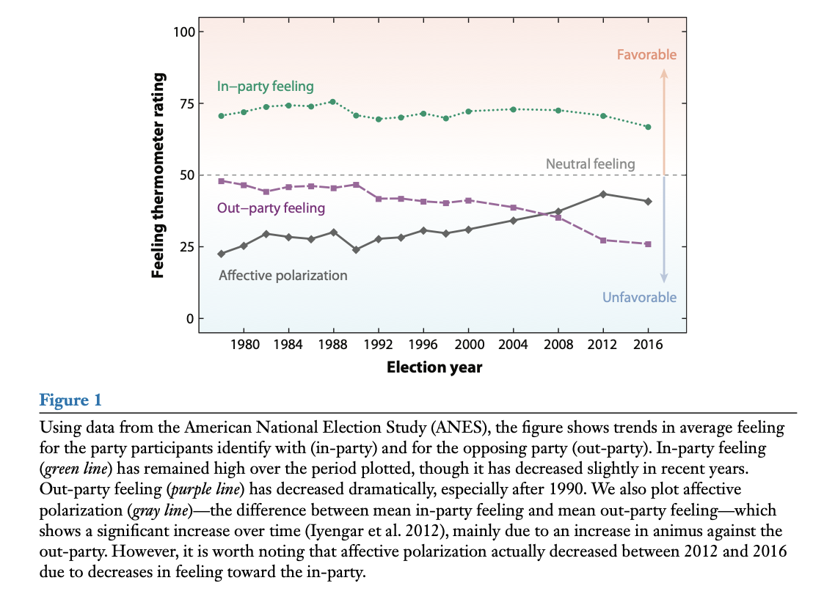
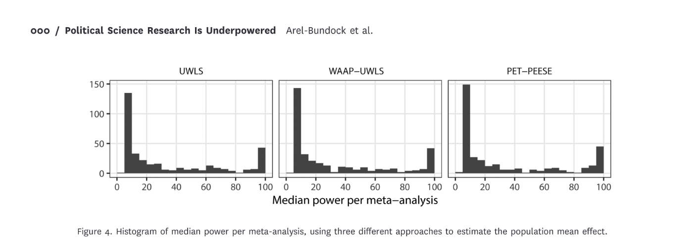

# An Agenda

```{r}
#| include: false
library(tidyverse)
```

------------------------------------------------------------------------

**Claim 1:** As political methodologists, we should place greater focus on critiques and refinements of current common practices rather than on pushing the bleeding edge forward. Both are great, but the former is undervalued. *Examples: textbooks, software, tutorial-style papers, and reviews of current practices.*

-   Andrew Gelman's textbooks (and blog) versus his articles.
-   Stan + {brms} + {marginaleffects}
-   @ornstein2023: "It covers the history of MRP, recent advances, an example analysis with code, and concludes with a discussion of best practices and limitations of the approach."
-   @lal2024: "we replicate 67 articles published in three top political science journals from 2010 to 2022 and identify several concerning patterns... We provide a checklist and software to help researchers avoid these pitfalls and improve their practice."

------------------------------------------------------------------------

**Claim 2**: As a discipline, we should value description more!

-   @iyengar2019: "Ordinary Americans increasingly dislike and distrust those from the other party."
-   @holliday2024: "Democrats and Republicans overwhelmingly and consistently oppose norm violations and partisan violence—even when their own representatives engage in antidemocratic actions."
-   @fowler2023: We find there are many genuine moderates in the American electorate. Nearly three in four survey respondents' issue positions are well described by a single left–right dimension, and most of those individuals have centrist views."
-   @little2024: "Despite the general narrative that the world is in a period of democratic decline \[around the world\], there have been surprisingly few empirical studies that assess whether this is systematically true."

------------------------------------------------------------------------

My description of political science: *An investigation of how we can intervene in the world to make the world a better place.* (Not everyone agrees!)

-   Explicit normative goals or criteria. (We don't have to agree on these or how to trade these off against each other.)
-   Understand the causal effects of potential interventions.
-   A clear description of the world we are intervening into.

::: callout-tip
## Advice

Avoid the *race to a regression.*
:::

------------------------------------------------------------------------

**Claim 3**: As a discipline, we should be more mindful of noise.

-   Important consequences for *you*. You want to conduct studies hat allow you to make meangingful claims at the end. (After all, they take hundreds of hours!)
-   Important consequences for *literatures*.

# The Importance of Claims and Tests

------------------------------------------------------------------------

::::: columns
::: column
At the core of empirical research, we have *claims* about the world. These can be descriptive or causal.

Example: "Ordinary Americans increasingly dislike and distrust those from the other party" [@iyengar2019].
:::

::: column

:::
:::::

Generally, we want to make empirical claims when we think they are correct (i.e., when we can rule out *other* claims).

## Hypothesis Testing

### Research Hypothesis

A researcher posits a theoretically interesting hypothesis $H_r$, sometimes called the “alternative” or “research” hypothesis.

::: {#def-research-hypothesis .defbox}
A research hypothesis $H_r$ is a claim that the parameter of interest $\theta$ lies in a specific region $B \subset \mathbb{R}$.
:::

Typical forms in political science:

-   $H_r: \theta > 0$ (positive effect)
-   $H_r: \theta < 0$ (negative effect)
-   $H_r: \theta > m$, where $m$ is a *substantively meaningful* threshold
-   $H_r: \theta \in (-m,m)$ to test for **negligible** effects [see @rainey2014].

------------------------------------------------------------------------

### Null Hypothesis

Each research hypothesis implies a null hypothesis.

::: {#def-null-hypothesis .defbox}
$H_0$ claims that $\theta \in B^C$ (i.e., the research hypothesis is false).
:::

Note: The null does **not** always state “no effect.”\
For example, if $H_r: \theta > 1$, then $H_0: \theta \le 1$.

------------------------------------------------------------------------

## Testing Hypotheses

A **test statistic** summarizes evidence against the null hypothesis.

::: {#def-test-statistic .defbox}
A test statistic $T(\mathbf{x}) \in [0,\infty)$ increases (or decreases) with evidence against $H_0$.
:::

A **hypothesis test** divides possible values of $T$ into:

-   **Rejection region** $R$ → reject $H_0$
-   **Non-rejection region** $R^C$ → fail to reject $H_0$

**Important**: Failure to reject $H_0$ mean *ambiguous evidence*, not evidence that $H_0$ is true.

------------------------------------------------------------------------

## Errors in Hypothesis Testing

Two types of errors:

| Name | Label | Longer Label | Error Rate | Person in Charge |
|---------------|---------------|---------------|---------------|---------------|
| Type I | “False Positive” | You claim that your research hypothesis is true, but it is not true. | 5% | Statistician |
| Type II | “False Negative” / “Lost Opportunity” | You cannot make a claim about your research hypothesis. | ??? | You, the researcher |

::: aside
You make an "error" when you make a claim that is false. When we design procedures, we should control the error rate.
:::

------------------------------------------------------------------------

## $p$-Value

Given a test statistic $T$ (larger values → more evidence against $H_0$):

::: {#def-hypothesis-test .defbox}
$p\text{-value} = \max_{\theta \in B^C} P(T(\mathbf{X}) \ge T(\mathbf{x}))$
:::

"The probability of obtaining data *more extreme* that the data we actually obtained if the null hypothesis were true."

Reject $H_0$ if and only if $p \le \alpha$ (e.g., $\alpha = 0.05$).

::: aside
$p$-values are a beautiful, elegant, and powerful way to make empirical arguments with noisy data. No proposed solution (e.g., Bayes factors, posterior probabilities, $S$-values) solves the "problems" with $p$-values.
:::

------------------------------------------------------------------------

## Power and Size

::: {#def-power-function .defbox}
The **power function** gives $\Pr(\text{reject } H_0 \mid \theta)$.
:::

We want:

-   Low rejection probability when $\theta \in B^C$
-   High rejection probability when $\theta \in B$

::: {#def-size .defbox}
A **size-**$\alpha$ test has maximum Type I error probability equal to $\alpha$.
:::

------------------------------------------------------------------------

## Example: Testing a Substantively Meaningful Effect

::::: columns
::: column
Let $\theta = \mu_1 - \mu_2$.

-   Research hypothesis: $H_r : \theta > 1$\
-   Null hypothesis: $H_0 : \theta \le 1$

Test statistic: $T = \frac{\hat{\theta} - 1}{\text{SE}(\hat{\theta})}$

$p$-value: $p = P(Z \ge T)$ where $Z \sim N(0,1)$.

Reject $H_0$ if $p \le 0.05$. Otherwise, evidence is ambiguous.
:::

::: column
```{r}
#| echo: false
#| fig-asp: 1
#| fig-width: 6

library(ggplot2)

alpha <- 0.05
se_hat <- 0.3
theta_seq <- seq(0, 2, length.out = 500)
z_alpha <- qnorm(1 - alpha)

power <- 1 - pnorm(z_alpha - (theta_seq - 1) / se_hat)

df <- data.frame(theta = theta_seq, power = power, null_region = theta_seq <= 1)

ggplot(df, aes(x = theta, y = power)) +
  geom_line(size = 1.2) +
  geom_area(data = subset(df, null_region), aes(x = theta, y = power),
            fill = "gray90", alpha = 0.6) +
  geom_hline(yintercept = alpha, linetype = "dashed", color = "red") +
  labs(title = "Power Function for One-Sided Test",
       subtitle = expression(H[0]*":"~theta <= 1~~"vs"~~H[r]*":"~theta > 1),
       x = expression(theta), y = "Power") +
  theme_minimal(base_size = 14)
```
:::
:::::

------------------------------------------------------------------------

## Confidence Intervals and Hypothesis Tests

One way to create a confidence interval is to invert a hypothesis test.

For example, suppose a hypothesis $H_r: \theta > m$.

-   For any particular $m$, we can compute a $p$-value and will either reject the null hypothesis or not.
-   We can collect the $m$ for which we rejected the null hypothesis into a collection; and collect the $m$ for which we *did not* reject the null hypothesis into a separate collection.
-   For the usual *z*-test (or *t*-test), there will be a single value $m^*$ that partitions the parameter space $\Theta$ into those (smaller) $m \leq m^*$ that can be rejected and those (larger) $m > m^*$ that cannot be rejected.
-   If we set $m^* = L$, the $[L, \infty)$ is a 95% *one-sided* confidence interval.
-   $L$ tells us the smallest $\theta$ that we cannot reject with a one-sided, size-0.05 test.

------------------------------------------------------------------------

We could similarly do this for $H_r: \theta < m$.

-   Find 95% *one-sided* confidence interval the $(-\infty, U]$.
-   $U$ tells us the largest $\theta$ that we cannot reject with a one-sided, size-0.05 test.

------------------------------------------------------------------------

If we use the $L$ and the $U$ from above, we have a 90% CI.

The endpoints of this 90% CI tell us...

-   the smallest $\theta$ that we cannot reject with a one-sided, size-0.05 test.
-   the largest $\theta$ that we cannot reject with a one-sided, size-0.05 test.

::: callout-warning
## Warning

Be careful of your claim!

-   "$X$ has a large, substantively meaningful effect on $E(Y)$."
    -   Can you reject all substantively negligible effects?
    -   Is $L$ in the 90% CI substantively meaningful?
-   "$X$ has no effect on $E(Y)$."
    -   Can you reject all non-zero effects? (No! Never.)
    -   Is $L$ in the 90% CI substantively meaningful?
    -   Is $U$ in the 90% CI substantively meaningful?\
:::

------------------------------------------------------------------------

::: callout-tip
## Advice

Only make a claim if the claim is hold for the *entire* confidence interval.
:::

Read @rainey2014 and @mccaskey2015.

**Exam Question**

I like to say: "Only make a claim if the claim is hold for the *entire* confidence interval." Using the arguments from @rainey2014 and @mccaskey2015, give two examples of how current practice deviates from this advice. Explain why these deviations matter. Explain a how my advice applies to these two sitations.

Examples:

1.  @mccaskey2015: Claiming "substantively sign9ficant" if point estimate is meaningful (and the statistically significant).
2.  @rainey2014: Claiming "no effect" when an estimate is not statistically significant.

::: aside
I like 90% CIs for principled reasons---it corresponds to a size-0.05 test for the claims we typically make. But others prefer 95% CIs. That's fine, too.
:::

------------------------------------------------------------------------

## Testing for Negligible Effects

I write about this in @rainey2014.

Define a threshold $m > 0$ for the smallest substantively meaningful effect.

::: {#def-negligible-effect .defbox}
$H_r : \theta \in (-m, m)$ = effect is negligible.
:::

::: {#def-non-negligible-null .defbox}
$H_0 : \theta \le -m \text{ or } \theta \ge m$ = effect is meaningfully large (+ or -).
:::

Use the **two one-sided tests (TOST)** procedure.

-   Test both $H_{r1}: \theta < m$ and $H_{r2}: \theta > -m$.
-   We need to reject *both* null hypothesis.

We **reject** $H_0$ if the $(1-2\alpha)$ confidence interval lies entirely inside $(-m,m)$. A 90% CI gives you a size-0.05 equivalence test.

# Power

------------------------------------------------------------------------

-   You spend years on a study.
-   The chance that your are wasting your time is non-trivial.
-   But... this chance can be investigated beforehand.

How to compute power?

-   "Power Rules" \[[preprint](https://doi.org/10.31219/osf.io/5am9q_v2)\]
-   G\*Power \[[web](https://www.psychologie.hhu.de/arbeitsgruppen/allgemeine-psychologie-und-arbeitspsychologie/gpower)\]
-   {DeclareDesign} \[[book](https://book.declaredesign.org)\]
-   MC simulations

The MDE: What effect can I detect with 80% or 95% power?

------------------------------------------------------------------------

```{tikz}
#| echo: false
\begin{tikzpicture}[>=stealth]

% axis line with arrowheads
\draw[<->] (-6,0) -- (6,0);

% tick marks
\draw ( -3,0.15) -- ( -3,-0.15) node[below=4pt] {$-m$};
\draw (  0,0.15) -- (  0,-0.15) node[below=4pt] {$0$};
\draw (  3,0.15) -- (  3,-0.15) node[below=4pt] {$m$};

% region labels
\node[above] at (-4.5,0.15) {meaningful};
\node[above] at (-1.5,0.15) {trivial};
\node[above] at ( 1.5,0.15) {trivial};
\node[above] at ( 4.5,0.15) {meaningful};

\end{tikzpicture}
```

You want your standard error to be about $\frac{m}{3.3}$.

-   This gives you 95% power to detect an effect of $m$.
-   This (nearly) guarantees that the 90% CI will include *at most* two regions.

For your research area, you should have this diagram in mind, an $m$ in mind, and the implied target SE in mind.

::: aside
In talks, you might have heard me ask about the scale of the estimates. I usually asked how an estimate should be interpreted. But I'm looking at the SE when I ask that question, because I'm constructed this picture in my mind and I want to know how the SE compares to $m$.
:::

## The Consequences of Power

```{r}
# parameters
sd_y <- 1.0
ate <- 0.1
N <- c(100, 500, 2500, 4500)

# compute power
se <- 2*sd_y/(sqrt(N))  # rule 3 from "power rules"
pwr <- 1-pnorm(1.64 - ate/se); pwr  # rule 2
```

```{r}
#| cache: true

# do MC simulation
set.seed(123)
res_list <- NULL
iter <- 1
for (i in 1:10000) {
  for (j in 1:length(N)) {
    # simulate data and fit model
    y0 <- rnorm(N[j]/2, mean = 0, sd = sd_y)
    y1 <- rnorm(N[j]/2, mean = 0 + ate, sd = sd_y)
    fit <- t.test(y1, y0, conf.level = 0.90)
    # store results
    res_list[[iter]] <- list(
      study_id = i,
      N = N[j],
      pwr = pwr[j],
      est = fit$estimate[1] -fit$estimate[2] ,
      l = fit$conf.int[1],
      u = fit$conf.int[2]
    )
    iter <- iter + 1
  }
}
res <- bind_rows(res_list) 

res |>
  group_by(N, pwr) |>
  summarize(n_mc = n(), mc_pwr = mean(l > 0))
```

------------------------------------------------------------------------

```{r}
#| echo: false
#| fig-asp: 1.1
#| fig-width: 8

gg_df <- res |>
  filter(study_id <= 50) |>
  mutate(sig = case_when(l > 0 ~ "Significant; Right Direction", 
                   u < 0 ~ "Significant; Wrong Direction", 
                   TRUE ~ "Not Significant")) |>
  mutate(N_lab = paste0("N = ", scales::comma(N), "; power = ", scales::percent(pwr, accuracy = 1)), 
         N_lab = reorder(N_lab, N))

ggplot(gg_df, aes(x = est, xmin = l, xmax = u, y = factor(study_id), 
                  color = sig, alpha = sig)) + 
  geom_vline(xintercept = 0.10, color = "grey50") + 
  geom_vline(xintercept = 0.00, color = "grey50", linetype = "dotted") + 
  geom_point() + 
  geom_errorbarh(width = 0) + 
  facet_wrap(vars(N_lab), ncol = length(N)) + 
  theme_minimal() + 
  theme(panel.grid = element_blank()) +
  scale_color_manual(values = c("grey", "#1b9e77", "#d95f02")) + 
  scale_alpha_manual(values = c(0.2, 1, 1)) + 
  labs(title = "Testing Across a Career", 
       x = "Estimate and 90% CI", 
       y = "Study Number", 
       color = "Result", 
       alpha = "Result")
```

------------------------------------------------------------------------

```{r}
#| echo: false
#| fig-asp: 0.6
#| fig-width: 9

gg_df <- res |>
  mutate(sig = case_when(l > 0 ~ "Significant; Right Direction", 
                   u < 0 ~ "Significant; Wrong Direction", 
                   TRUE ~ "Not Significant")) |>
  mutate(N_lab = paste0("N = ", scales::comma(N), "; power = ", scales::percent(pwr, accuracy = 1)), 
         N_lab = reorder(N_lab, N))

ggplot(gg_df, aes(x = est, fill = sig, alpha = sig)) + 
  geom_histogram() + 
  geom_vline(xintercept = ate) + 
  facet_wrap(vars(N_lab), scales = "free") + 
  theme_minimal() + 
  theme(panel.grid = element_blank()) +
  scale_fill_manual(values = c("grey", "#1b9e77", "#d95f02")) + 
  scale_alpha_manual(values = c(0.2, 1, 1)) + 
  labs(title = "Testing Across a Career", 
       x = "Point Estimates", 
       y = "Number of Studies", 
       fill = "Result", 
       alpha = "Result")
  
```

------------------------------------------------------------------------

When you test with low power, you make three mistakes:

1.  When you do "get it right" you are guaranteed to have "wildly wrong" estimates.
2.  You often get it "wildly wrong" in the wrong direction.
3.  You often waste your time.

See @gelman2014.

## Literatures

What are the implications for literatures if we have 100s of researchers conducting poorly-powered studies *and* authors, editors, and reviewers filtering on statistical significance?

# So what is *observed* power in political science?

## Arel-Bundock et al.

"Under generous assumptions, we show that quantitative research in political science is greatly underpowered: the median analysis has about 10% power, and only about 1 in 10 tests have at least 80% power to detect the consensus effects reported in the literature."



Is this okay? Tragic? Desirable?

------------------------------------------------------------------------

## Exam Question

You are an editor of a journal and have received two thoughtful reviews for a well-done survey experiment. While previous work suggests that a treatment should have a positive effect, this new paper on your desk suggests that the treatment has a *negative* effect and they find a statistically significant negative effect.

-   Reviewer A notes that the sample size is small. They cite @gelman2014 and @arel-bundock2025 and suggest that the journal shouldn't publish underpowered work.
-   Reviewer B notes that while the sample size is small, the authors' test protects them against Type I errors as usual (in the sense that $\Pr(\text{make claim} \mid \text{claim is false}) \leq 0.05$). (Recall that power relates to Type II errors, which the authors definitely haven't made here.)

1. Explain each perspective more fully. 
1. How do you adjudicate between these perspectives? Describe the tradeoffs between a policy of (1) requiring that all papers be well-powered and (2) not considering the power once data have been collected. Which of these policies would you advocate for?
1. Years later, you are no longer an editor, but have accumulated some formal and informal power in the discipline. You decide to return to this issue. What norms, practices, or rules might you change to address this issue?

------------------------------------------------------------------------

# References
