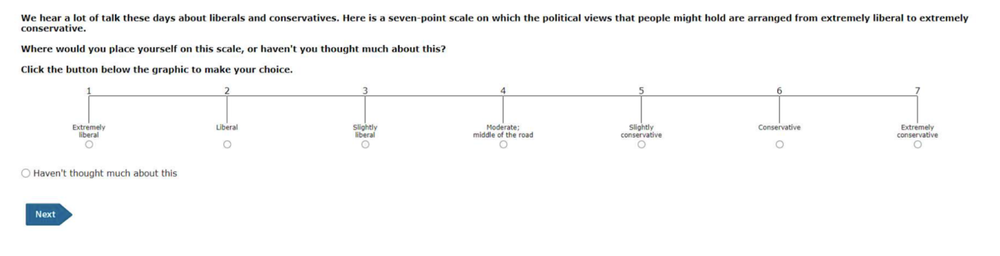

```{r}
#| include: false
library(tidyverse)
```

# Ordered Outcomes

Suppose an ordered outcome $y_i \in \{1, 2, \ldots, J\}$, where $\{1, 2, \ldots, J\}$ correspond to *qualitative labels* that have a natural ordering.

## Example 1

The ANES asks respondents to place themselves along a 7-point **ideology** scale with positions labeled "extremely liberal," "liberal," "slightly liberal," "moderate/middle of the road," "slightly conservative," "conservative," and "extremely conservative." 



We typically let 1, 2, 3, 4, 5, 6, and 7 correspond to these seven ordered labels.

## Example 2 {.smaller}

The **Political Terror Scale** (PTS) is a country-year measure of state repression. This measure assigns one of five qualitative labels summarizing the amount of state repression to each country-years based on reports from Amnesty International and the U.S. State Department.

| Numeric Coding | Qualitative Label |
|-------------------------------|-----------------------------------------|
| 1 | Countries under a secure rule of law, people are not imprisoned for their views, and torture is rare or exceptional. Political murders are extremely rare. |
| 2 | There is a limited amount of imprisonment for nonviolent political activity. However, few persons are affected, torture and beatings are exceptional. Political murder is rare. |
| 3 | There is extensive political imprisonment, or a recent history of such imprisonment. Execution or other political murders and brutality may be common. Unlimited detention, with or without a trial, for political views is accepted. |
| 4 | Civil and political rights violations have expanded to large numbers of the population. Murders, disappearances, and torture are a common part of life. In spite of its generality, on this level terror affects those who interest themselves in politics or ideas. |
| 5 | Terror has expanded to the whole population. The leaders of these societies place no limits on the means or thoroughness with which they pursue personal or ideological goals. |

## Ordered Logit

- Let linear predictor $\eta_i$ be our usual linear predictor so that $\eta_i = X_i^\beta$, except *without an intercept* $\beta_0$.
- Now define $J-1$ "cutpoints" $\alpha_1 < \alpha_2 < \cdots < \alpha_{J-1}$ that act as a separate intercept for each category.
- The **ordered logit** defines the the *cumulative* probabilities as

$$
\Pr(Y_i \leq j) = \text{logit}^{-1}(\alpha_j - \eta_i),
\qquad j = 1, \ldots, J-1.
$$

---

Then probabilities for each category are

$$
\begin{align}
\Pr(Y_i = 1) &= \text{logit}^{-1}(\alpha_1 - \eta_i) \\
\Pr(Y_i = 2) &= \text{logit}^{-1}(\alpha_2 - \eta_i) - \text{logit}^{-1}(\alpha_{1} - \eta_i) \\
\Pr(Y_i = 3) &= \text{logit}^{-1}(\alpha_3 - \eta_i) - \text{logit}^{-1}(\alpha_{3} - \eta_i) \\
             &\vdots\\
\Pr(Y_i = j) &= \overbrace{\text{logit}^{-1}(\alpha_j - \eta_i)}^{\Pr(Y_i \leq j)} - \overbrace{\text{logit}^{-1}(\alpha_{j-1} - \eta_i)}^{\Pr(Y_i \leq j-1)}, \qquad j = 2, \ldots, J-1 \\
             &\vdots\\
\Pr(Y_i = J) &= 1 - \text{logit}^{-1}(\alpha_{J-1} - \eta_i).
\end{align}
$$

## Illustrative Figure

The figure on the next slide shows this graphically for an outcome with four possible values.

-   I set the three cutpoints to $\alpha = (-2.5,-1.3,1.3)$.
-   I set the linear predictor for an example observation to $\eta_i = -1.5$.

---


```{r}
#| echo: false
#| message: false
#| warning: false
#| fig-asp: 0.75
#| fig-width: 8
library(tidyverse)
library(latex2exp)


# parameters
alpha <- sort(c(-2.5, -1.3, 1.3))
J <- length(alpha) + 1
eta   <- -1.5   

# make a color pallette
library(RColorBrewer)
colors_J <- brewer.pal(J, "Dark2")  # or "Set1", "Paired", "Accent"

cumulative_prob <- c(plogis(alpha - eta), 1)
prob <- c(cumulative_prob[1], diff(cumulative_prob))

# S-shaped curve
curve_df <- tibble(x = seq(-8, 8, by = 0.001)) |>
  mutate(prob = plogis(x))

# lines
x_lines_df <- tibble(x0 = alpha - eta, x1 = alpha - eta, 
                     y0 = 0, y1 = cumulative_prob[1:(J - 1)])

y_lines_df <- tibble(x0 = min(curve_df$x), x1 = alpha - eta, 
                     y0 = cumulative_prob[1:(J - 1)], y1 = cumulative_prob[1:(J - 1)])

# labels
x_labs <- paste0(
  r"($\alpha_{)", 1:(J - 1), r"(} - \eta_i = )",
  scales::number(alpha - eta, accuracy = 0.01),
  r"($)"
)
x_labels_df <- tibble(
  x = alpha - eta,
  y = cumulative_prob[1:(J - 1)]/2,
  label = TeX(x_labs)
)
y_labs <- paste0(
  r"($\Pr(Y_i \leq )", 1:(J - 1), ")",
  r"(=logit^{-1}(\alpha_{)", 1:(J - 1),
  r"(} - \eta_i)=)",
  scales::number(cumulative_prob[1:(J - 1)], accuracy = 0.01),
  r"($)"
)
y_labels_df <- tibble(
  x = (min(curve_df$x) + (alpha - eta)) / 2,
  y = cumulative_prob[1:(J - 1)],
  label = TeX(y_labs), 
  region = as.character(1:(J-1))
)

# probability labels
probs_df <- tibble(x = min(curve_df$x), y = cumulative_prob)
prob_labs <- paste0(
  r"($\Pr(Y_i = )", 1:J, ") = ",
  r"(\Pr(Y_i \leq )", (1:J), ") - ",
  r"(\Pr(Y_i \leq )", 1:J - 1, ") = ", 
  scales::number(prob[1:J], accuracy = 0.01),
  r"($)"
)
prob_labs[1] <- paste0(
  r"($\Pr(Y_i = 1) = \Pr(Y_i \leq 1) = )", 
  scales::number(prob[1], accuracy = 0.01),
  r"($)"
)
prob_labs[J] <- paste0(
  r"($\Pr(Y_i = )", J, ") =", r"(1 - \Pr(Y_i \leq )", J - 1, ") =", 
  scales::number(prob[J], accuracy = 0.01),
  r"($)"
)
prob_labels_df <- tibble(
  x = min(curve_df$x),
  y = cumulative_prob - diff(c(0, cumulative_prob))/2,
  label = TeX(prob_labs), 
  region = as.character(1:(J))
)

# y polygons: use a for-loop to build the polygons one at a time
y_poly_list <- NULL
y_poly_list[[1]] <- curve_df |>
  filter(x <= alpha[1] - eta) |>
  mutate(to = cumulative_prob[1], 
         from = prob) |>
  mutate(region = as.character(1))
for (j in 2:(J - 1)) {
  y_poly_list[[j]] <- curve_df |>
    filter(x <= alpha[j] - eta) |>
    mutate(to = cumulative_prob[j], 
           from = ifelse(cumulative_prob[j-1] > prob, cumulative_prob[j - 1], prob)) |>
    mutate(region = as.character(j))
}
y_poly_list[[J]] <- curve_df |>
  mutate(to = 1, 
         from = ifelse(cumulative_prob[J-1] > prob, cumulative_prob[J - 1], prob)) |>
  mutate(region = as.character(J))
y_poly_df <- bind_rows(y_poly_list)

# x polygons: use a for-loop to build the polygons one at a time
x_poly_list <- NULL
x_poly_list[[1]] <- curve_df |>
  filter(x <= alpha[1] - eta) |>
  mutate(to = prob, 
         from = 0) |>
  mutate(region = as.character(1))
for (j in 2:(J - 1)) {
  x_poly_list[[j]] <- curve_df |>
    filter(x <= alpha[j] - eta, x > alpha[j - 1] - eta) |>
    mutate(to = prob, 
           from = 0) |>
    mutate(region = as.character(j))
}
x_poly_list[[J]] <- curve_df |>
  filter(x > alpha[J - 1] - eta) |>
  mutate(to = prob, 
         from = 0) |>
  mutate(region = as.character(J))
x_poly_df <- bind_rows(x_poly_list)

# probability blocks
width <- diff(range(curve_df$x))*0.05
block_list <- NULL
block_list[[1]] <- tibble(x = seq(min(curve_df$x) - width, min(curve_df$x), by = 0.01)) |>
  mutate(from = 0, to = cumulative_prob[1], region = "1") 
for (j in 2:(J - 1)) {
  block_list[[j]] <- tibble(x = seq(min(curve_df$x) - width, min(curve_df$x), by = 0.01)) |>
    mutate(from = cumulative_prob[j-1], to = cumulative_prob[j], region = as.character(j))
}
block_list[[J]] <- tibble(x = seq(min(curve_df$x) - width, min(curve_df$x), by = 0.01)) |>
  mutate(from = cumulative_prob[J - 1], to = cumulative_prob[J], region = as.character(J))


block_df <- bind_rows(block_list)

ggplot() +
  geom_ribbon(data = block_df, aes(x = x, ymin = from, ymax = to, fill = region), alpha = 1.0, color = "black") +
  geom_segment(aes(x = min(curve_df$x), y = 0, yend = 1), color = "black") + 
  geom_segment(aes(x = min(curve_df$x) - width, y = 0, yend = 1), color = "black") + 
  geom_ribbon(data = x_poly_df, aes(x = x, ymin = from, ymax = to, fill = region), alpha = 0.35) +
  geom_ribbon(data = y_poly_df, aes(x = x, ymin = from, ymax = to, fill = region), alpha = 0.35) +
  
  geom_segment(data = x_lines_df, aes(x = x0, xend = x1, y = y0, yend = y1), linetype = "dotted") +
  geom_label(data = x_labels_df, aes(x = x, y = y, label = label), size = 3, parse = TRUE) +
  geom_segment(data = y_lines_df, aes(x = x0, xend = x1, y = y0, yend = y1), linetype = "dotted") +
  geom_segment(data = y_labels_df, aes(x = x, xend = x, y = y, yend = 0, color = region), linewidth = 4) + 
  
  geom_label(data = y_labels_df, aes(x = x, y = y, label = label, color = region), size = 3, parse = TRUE) +
  geom_line(data = curve_df, aes(x = x, y = prob)) +
  geom_point(data = x_lines_df, aes(x = x1, y = y1), shape = 21, fill = "white") +
  geom_point(data = probs_df, aes(x = x, y = y), pch = 19) +
  geom_label(data = prob_labels_df, aes(x = x - 2*width, y = y, label = label, color = region), , size = 3, parse = TRUE, hjust = 0) +
  labs(x = "Input to Inverse-Logit Function", y = "Probability", 
       caption = "linear predictor = -1.5; cutpoints = {-2.5, -1.3, 1.3}") +
  scale_fill_manual(values = colors_J) + 
  scale_color_manual(values = colors_J) + 
  theme_minimal() +
  theme(legend.position = "none")
```

# Example: Party ID by age and race in 2014

## `red-state-pid.csv`

As an example, we can model party ID as a function of income.

First, load a data set I've created with variables party id (`pid`) and income.

```{r}
#| message: false
#| warning: false
# load data
anes <- read_csv("https://pos5747.github.io/data/red-state-pid.csv") |>
  glimpse()
```

Notice that the ordinal party ID labels have a numerical prefix as part of the character string. This is helpful to (1) quickly remind us of the order and (2) ensure that the alphabetic order and ordinal rankings of their values are the same.

Because the dataset is in `.csv` format, `pid` is loaded as a character string, but we can easily convert it to an ordered factor.

---

```{r}
#| message: false
#| warning: false
# load data
anes <- read_csv("https://pos5747.github.io/data/red-state-pid.csv") |>
  mutate(pid = factor(pid, ordered = TRUE)) |>
  glimpse()

# examine levels of ordinal variable
levels(anes$pid)
```

Because of the numbers I included in the prefix, the default *alphabetical* ordering is *exactly the ordering we want.*

---

```{r}
# fit ordered logit model
library(MASS)  # be wary of conflicts with filter() and select()
fit <- polr(pid ~ income, data = anes, Hess = TRUE)

# summarize fit
summary(fit)
```

## Probabilities with {marginaleffects}

To interpret the coefficients, we can compute the probability of falling into each category as age varies from 18 to 89 years.

```{r}
#| fig-asp: 0.5

# use {marginaleffects}
library(marginaleffects)
p <- predictions(fit, 
            newdata = datagrid(income = unique)) |>
  glimpse()
```

---

```{r}
ggplot(p, aes(x = income, y = estimate, color = group)) + 
  geom_point() + 
  geom_line()
```

## Computing cumulative probabilities

- However, the probabilities above are somewhat awkward to interpret. 
- As the middle categories shrink, it isn't immediately clear what categories are growing as a result. I
- nstead, we can compute an easier-to-interpret **cumulative probability** $\Pr(y_i \leq j)$ using `cumsum()` within `arrange()`ed groups.

```{r}
#| fig-asp: 0.5
cumulative_p <- p %>%
  arrange(income, group) %>%
  group_by(income) %>%
  mutate(cumulative_prob = cumsum(estimate),
         j = as.integer(group),
         cdf_label = paste0("Pr(Y ≤ ", group, ")"),
         cdf_label = reorder(cdf_label, j)) %>%
  ungroup()
```

---

```{r}
ggplot(cumulative_p, aes(x = income, y = cumulative_prob, color = cdf_label)) + 
  geom_line() 
```

---

Alternatively, w can use `position = "stack"` with `geom_line()` or `geom_area()` to trick `ggplot()` into plotting the cumulative probabilities for us if we don't want to compute them manually first.

```{r}
ggplot(p, aes(x = income, y = estimate, color = group)) +
  geom_line(position = "stack")
```
---

```{r}
ggplot(p, aes(x = income, y = estimate, fill = group)) +
  geom_area(position = "stack")
```

# Example: The varying relationship across years

---

- We can use a hierarchical variant to model the differences across states.
- Consistent with Gelman et al.'s "red state, blue state" argument, the changes across income might vary across rich and poor states.
- With that in mind, we allow varying intercepts and slopes across states and model those using state median income.

`pid ~ income*rs_state_median_income + (1 + income | state_name)`

---

```{r}
#| message: false
#| warning: false
#| cache: true
#| results: hide
# load packages
library(brms)

# fit same model, but coefs vary across years
fit <- brm(pid ~ income*rs_state_median_income + (1 + income | state_name), 
           data = anes, 
           family = cumulative(),
           cores = 4, 
           chains = 4, 
           warmup = 2000, 
           iter = 4000,
           backend = "rstan")
```

---

Now we can plot the cumulative probabilities for each of the states and see that the effect of income does indeed vary across the states.

```{r}
#| fig-asp: 0.65
#| fig-width: 8
#| code-fold: true

# make grid 
grid <- anes %>%
  dplyr::select(state_name, state_median_income, rs_state_median_income) %>%
  distinct() %>%
  mutate(income = NA)

# make predictions
p <- predictions(fit, 
                 variables = list(income = unique),
                 newdata = grid) |>
  mutate(state_name = reorder(state_name, rs_state_median_income))

# make plot
gg <- ggplot(p, aes(x = income, y = estimate, fill = group)) +
  geom_area(position = "stack") +
  facet_wrap(vars(state_name))  +
  scale_fill_brewer(palette = "RdBu", direction = -1)
print(gg)
```

---

```{r}
#| echo: false
#| fig-asp: 0.65
#| fig-width: 8

print(gg)
```

---

```{r}
#| echo: false
#| fig-asp: 0.5
#| fig-width: 8


# make plot
p <- filter(p, state_name %in% c("Mississippi", "District of Columbia"))
gg <- ggplot(p, aes(x = income, y = estimate, fill = group)) +
  geom_area(position = "stack") +
  facet_wrap(vars(state_name))  +
  scale_fill_brewer(palette = "RdBu", direction = -1)
print(gg)
```


