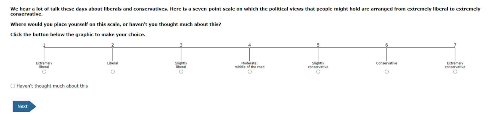

```{r}
#| include: false
library(tidyverse)
```

# Ordered Outcomes

Suppose an ordered outcome $y_i \in \{1, 2, \ldots, J\}$, where $\{1, 2, \ldots, J\}$ correspond to *qualitative labels* that have a natural ordering.

## Example 1

The ANES asks respondents to place themselves along a 7-point **ideology** scale with positions labeled "extremely liberal," "liberal," "slightly liberal," "moderate/middle of the road," "slightly conservative," "conservative," and "extremely conservative." 



We typically let 1, 2, 3, 4, 5, 6, and 7 correspond to these seven ordered labels.

## Example 2 {.smaller}

The **Political Terror Scale** (PTS) is a country-year measure of state repression. This measure assigns one of five qualitative labels summarizing the amount of state repression to each country-years based on reports from Amnesty International and the U.S. State Department.

| Numeric Coding | Qualitative Label |
|-------------------------------|-----------------------------------------|
| 1 | Countries under a secure rule of law, people are not imprisoned for their views, and torture is rare or exceptional. Political murders are extremely rare. |
| 2 | There is a limited amount of imprisonment for nonviolent political activity. However, few persons are affected, torture and beatings are exceptional. Political murder is rare. |
| 3 | There is extensive political imprisonment, or a recent history of such imprisonment. Execution or other political murders and brutality may be common. Unlimited detention, with or without a trial, for political views is accepted. |
| 4 | Civil and political rights violations have expanded to large numbers of the population. Murders, disappearances, and torture are a common part of life. In spite of its generality, on this level terror affects those who interest themselves in politics or ideas. |
| 5 | Terror has expanded to the whole population. The leaders of these societies place no limits on the means or thoroughness with which they pursue personal or ideological goals. |

## Ordered Logit

- Let linear predictor $\eta_i$ be our usual linear predictor so that $\eta_i = X_i \beta$, except *without an intercept* $\beta_0$.
- Now define $J-1$ "cutpoints" $\alpha_1 < \alpha_2 < \cdots < \alpha_{J-1}$ that act as a separate intercept for each category.
- The **ordered logit** defines the the *cumulative* probabilities as

$$
\Pr(Y_i \leq j) = \text{logit}^{-1}(\alpha_j - \eta_i),
\qquad j = 1, \ldots, J-1.
$$

---

Then probabilities for each category are

$$
\begin{align}
\Pr(Y_i = 1) &= \text{logit}^{-1}(\alpha_1 - \eta_i) \\
\Pr(Y_i = 2) &= \text{logit}^{-1}(\alpha_2 - \eta_i) - \text{logit}^{-1}(\alpha_{1} - \eta_i) \\
\Pr(Y_i = 3) &= \text{logit}^{-1}(\alpha_3 - \eta_i) - \text{logit}^{-1}(\alpha_{2} - \eta_i) \\
             &\vdots\\
\Pr(Y_i = j) &= \overbrace{\text{logit}^{-1}(\alpha_j - \eta_i)}^{\Pr(Y_i \leq j)} - \overbrace{\text{logit}^{-1}(\alpha_{j-1} - \eta_i)}^{\Pr(Y_i \leq j-1)}, \qquad j = 2, \ldots, J-1 \\
             &\vdots\\
\Pr(Y_i = J) &= 1 - \text{logit}^{-1}(\alpha_{J-1} - \eta_i).
\end{align}
$$

## Illustrative Figure

The figure on the next slide shows this graphically for an outcome with four possible values.

-   I set the three cutpoints to $\alpha = (-2.5,-1.3,1.3)$.
-   I set the linear predictor for an example observation to $\eta_i = -1.5$.

---


```{r}
#| echo: false
#| message: false
#| warning: false
#| fig-asp: 0.75
#| fig-width: 8
library(tidyverse)
library(latex2exp)


# parameters
alpha <- sort(c(-2.5, -1.3, 1.3))
J <- length(alpha) + 1
eta   <- -1.5   

# make a color pallette
library(RColorBrewer)
colors_J <- brewer.pal(J, "Dark2")  # or "Set1", "Paired", "Accent"

cumulative_prob <- c(plogis(alpha - eta), 1)
prob <- c(cumulative_prob[1], diff(cumulative_prob))

# S-shaped curve
curve_df <- tibble(x = seq(-8, 8, by = 0.001)) |>
  mutate(prob = plogis(x))

# lines
x_lines_df <- tibble(x0 = alpha - eta, x1 = alpha - eta, 
                     y0 = 0, y1 = cumulative_prob[1:(J - 1)])

y_lines_df <- tibble(x0 = min(curve_df$x), x1 = alpha - eta, 
                     y0 = cumulative_prob[1:(J - 1)], y1 = cumulative_prob[1:(J - 1)])

# labels
x_labs <- paste0(
  r"($\alpha_{)", 1:(J - 1), r"(} - \eta_i = )",
  scales::number(alpha - eta, accuracy = 0.01),
  r"($)"
)
x_labels_df <- tibble(
  x = alpha - eta,
  y = cumulative_prob[1:(J - 1)]/2,
  label = TeX(x_labs)
)
y_labs <- paste0(
  r"($\Pr(Y_i \leq )", 1:(J - 1), ")",
  r"(=logit^{-1}(\alpha_{)", 1:(J - 1),
  r"(} - \eta_i)=)",
  scales::number(cumulative_prob[1:(J - 1)], accuracy = 0.01),
  r"($)"
)
y_labels_df <- tibble(
  x = (min(curve_df$x) + (alpha - eta)) / 2,
  y = cumulative_prob[1:(J - 1)],
  label = TeX(y_labs), 
  region = as.character(1:(J-1))
)

# probability labels
probs_df <- tibble(x = min(curve_df$x), y = cumulative_prob)
prob_labs <- paste0(
  r"($\Pr(Y_i = )", 1:J, ") = ",
  r"(\Pr(Y_i \leq )", (1:J), ") - ",
  r"(\Pr(Y_i \leq )", 1:J - 1, ") = ", 
  scales::number(prob[1:J], accuracy = 0.01),
  r"($)"
)
prob_labs[1] <- paste0(
  r"($\Pr(Y_i = 1) = \Pr(Y_i \leq 1) = )", 
  scales::number(prob[1], accuracy = 0.01),
  r"($)"
)
prob_labs[J] <- paste0(
  r"($\Pr(Y_i = )", J, ") =", r"(1 - \Pr(Y_i \leq )", J - 1, ") =", 
  scales::number(prob[J], accuracy = 0.01),
  r"($)"
)
prob_labels_df <- tibble(
  x = min(curve_df$x),
  y = cumulative_prob - diff(c(0, cumulative_prob))/2,
  label = TeX(prob_labs), 
  region = as.character(1:(J))
)

# y polygons: use a for-loop to build the polygons one at a time
y_poly_list <- NULL
y_poly_list[[1]] <- curve_df |>
  filter(x <= alpha[1] - eta) |>
  mutate(to = cumulative_prob[1], 
         from = prob) |>
  mutate(region = as.character(1))
for (j in 2:(J - 1)) {
  y_poly_list[[j]] <- curve_df |>
    filter(x <= alpha[j] - eta) |>
    mutate(to = cumulative_prob[j], 
           from = ifelse(cumulative_prob[j-1] > prob, cumulative_prob[j - 1], prob)) |>
    mutate(region = as.character(j))
}
y_poly_list[[J]] <- curve_df |>
  mutate(to = 1, 
         from = ifelse(cumulative_prob[J-1] > prob, cumulative_prob[J - 1], prob)) |>
  mutate(region = as.character(J))
y_poly_df <- bind_rows(y_poly_list)

# x polygons: use a for-loop to build the polygons one at a time
x_poly_list <- NULL
x_poly_list[[1]] <- curve_df |>
  filter(x <= alpha[1] - eta) |>
  mutate(to = prob, 
         from = 0) |>
  mutate(region = as.character(1))
for (j in 2:(J - 1)) {
  x_poly_list[[j]] <- curve_df |>
    filter(x <= alpha[j] - eta, x > alpha[j - 1] - eta) |>
    mutate(to = prob, 
           from = 0) |>
    mutate(region = as.character(j))
}
x_poly_list[[J]] <- curve_df |>
  filter(x > alpha[J - 1] - eta) |>
  mutate(to = prob, 
         from = 0) |>
  mutate(region = as.character(J))
x_poly_df <- bind_rows(x_poly_list)

# probability blocks
width <- diff(range(curve_df$x))*0.05
block_list <- NULL
block_list[[1]] <- tibble(x = seq(min(curve_df$x) - width, min(curve_df$x), by = 0.01)) |>
  mutate(from = 0, to = cumulative_prob[1], region = "1") 
for (j in 2:(J - 1)) {
  block_list[[j]] <- tibble(x = seq(min(curve_df$x) - width, min(curve_df$x), by = 0.01)) |>
    mutate(from = cumulative_prob[j-1], to = cumulative_prob[j], region = as.character(j))
}
block_list[[J]] <- tibble(x = seq(min(curve_df$x) - width, min(curve_df$x), by = 0.01)) |>
  mutate(from = cumulative_prob[J - 1], to = cumulative_prob[J], region = as.character(J))


block_df <- bind_rows(block_list)

ggplot() +
  geom_ribbon(data = block_df, aes(x = x, ymin = from, ymax = to, fill = region), alpha = 1.0, color = "black") +
  geom_segment(aes(x = min(curve_df$x), y = 0, yend = 1), color = "black") + 
  geom_segment(aes(x = min(curve_df$x) - width, y = 0, yend = 1), color = "black") + 
  geom_ribbon(data = x_poly_df, aes(x = x, ymin = from, ymax = to, fill = region), alpha = 0.35) +
  geom_ribbon(data = y_poly_df, aes(x = x, ymin = from, ymax = to, fill = region), alpha = 0.35) +
  
  geom_segment(data = x_lines_df, aes(x = x0, xend = x1, y = y0, yend = y1), linetype = "dotted") +
  geom_label(data = x_labels_df, aes(x = x, y = y, label = label), size = 3, parse = TRUE) +
  geom_segment(data = y_lines_df, aes(x = x0, xend = x1, y = y0, yend = y1), linetype = "dotted") +
  geom_segment(data = y_labels_df, aes(x = x, xend = x, y = y, yend = 0, color = region), linewidth = 4) + 
  
  geom_label(data = y_labels_df, aes(x = x, y = y, label = label, color = region), size = 3, parse = TRUE) +
  geom_line(data = curve_df, aes(x = x, y = prob)) +
  geom_point(data = x_lines_df, aes(x = x1, y = y1), shape = 21, fill = "white") +
  geom_point(data = probs_df, aes(x = x, y = y), pch = 19) +
  geom_label(data = prob_labels_df, aes(x = x - 2*width, y = y, label = label, color = region), , size = 3, parse = TRUE, hjust = 0) +
  labs(x = "Input to Inverse-Logit Function", y = "Probability", 
       caption = "linear predictor = -1.5; cutpoints = {-2.5, -1.3, 1.3}") +
  scale_fill_manual(values = colors_J) + 
  scale_color_manual(values = colors_J) + 
  theme_minimal() +
  theme(legend.position = "none")
```

# Example: Approval of President Bush, 1992

## The data {.smaller}

- Data: 1992 ANES Time Series Study [@anes1992].
- Outcome: approval of President Bush's job performance, four categories: strongly disapprove, disapprove, approve, and strongly approve.
- Predictors:
  - `military_force`: how willing the United States should be to use military force to solve international problems, from 1 (extremely willing) to 5 (never willing).
  - `ideology_distance`: distance between the respondent's ideology and where they place Bush, from 0 (same position) to 6 (opposite ends of the 7-point scale).
  - `economy`: evaluation of the national economy compared with a year ago, from 1 (much better) to 5 (much worse).
  - `party_id`: party identification, from −3 (strong Democrat) through 0 (independent) to 3 (strong Republican).
  - `education`: years of education.
- 750 respondents; 558 complete on these variables.

::: aside
This example comes from Chris Adolph's maximum likelihood course. The model and the codebook are described in his Problem Set 4 [@adolph2025]. Adolph fits an ordered *probit* (`method = "probit"` in `polr()`). I fit an ordered logit to match the notes.
:::

## `bush-approval-1992.csv` {.smaller}

First, load the data set with the approval ratings (`bush_approval`) and the five predictors.

```{r}
# load data
approval <- read_csv("https://pos5747.github.io/data/bush-approval-1992.csv") |>
  glimpse()
```

Notice that the ordinal approval labels have a numerical prefix as part of the character string. This is helpful to (1) quickly remind us of the order and (2) ensure that the alphabetic order and ordinal rankings of their values are the same.

Because the dataset is in `.csv` format, `bush_approval` is loaded as a character string, but we can easily convert it to an ordered factor.

---

```{r}
# convert the outcome to an ordered factor
approval <- approval |>
  mutate(bush_approval = factor(bush_approval, ordered = TRUE)) |>
  glimpse()

# examine levels of ordinal variable
levels(approval$bush_approval)
```

Because of the numbers in the prefix, the default *alphabetical* ordering is *exactly the ordering we want.*

---

```{r}
# fit ordered logit model
library(MASS)  # be wary of conflicts with filter() and select()
fit <- polr(bush_approval ~ military_force + ideology_distance + economy + party_id + education, 
            data = approval, Hess = TRUE)

# summarize fit
summary(fit)
```

## Interpreting the coefficients

- Positive `party_id` coefficient means that higher categories are more likely, so Republicans are more approving.
- Negative coefficients indicate who is more *disapproving*: 
   - respondents who are more opposed to military force
   - respondents who are ideologically further from Bush
   - respondents who perceive the economy as worse.

## Probabilities with {marginaleffects} {.smaller}

To interpret the coefficients, we can compute the probability of falling into each category as `military_force` varies from 1 to 5, for strong Democrats (`party_id = -3`) and strong Republicans (`party_id = 3`). The other predictors sit at their means (the `datagrid()` default).

```{r}
# use {marginaleffects}
library(marginaleffects)
p <- predictions(fit, 
            newdata = datagrid(military_force = 1:5, 
                               party_id = c(-3, 3))) |>
  glimpse()
```

---

```{r}
ggplot(p, aes(x = military_force, y = estimate, color = group)) + 
  geom_point() + 
  geom_line() +
  facet_wrap(vars(party_id), labeller = label_both)
```

## Computing cumulative probabilities

- However, the probabilities above are somewhat awkward to interpret. 
- As some categories shrink, it isn't immediately clear what categories are growing as a result. Instead, we can compute an easier-to-interpret **cumulative probability** $\Pr(y_i \leq j)$ using `cumsum()` within `arrange()`ed groups.

```{r}
cumulative_p <- p %>%
  arrange(party_id, military_force, group) %>%
  group_by(party_id, military_force) %>%
  mutate(cumulative_prob = cumsum(estimate),
         j = as.integer(group),
         cdf_label = paste0("Pr(Y ≤ ", group, ")"),
         cdf_label = reorder(cdf_label, j)) %>%
  ungroup()
```

---

```{r}
ggplot(cumulative_p, aes(x = military_force, y = cumulative_prob, color = cdf_label)) + 
  geom_line() +
  facet_wrap(vars(party_id), labeller = label_both)
```

---

Alternatively, `position_stack(reverse = TRUE)` with `geom_line()` or `geom_area()` makes `ggplot()` stack the probabilities for us: the line for category $j$ sits at $\Pr(Y_i \leq j)$, the same curves as above without computing them by hand. (The default, `position = "stack"`, stacks the first level on top, which gives $\Pr(Y_i \geq j)$ instead.)

```{r}
ggplot(p, aes(x = military_force, y = estimate, color = group)) +
  geom_line(position = position_stack(reverse = TRUE)) +
  facet_wrap(vars(party_id), labeller = label_both)
```

---

```{r}
ggplot(p, aes(x = military_force, y = estimate, fill = group)) +
  geom_area(position = position_stack(reverse = TRUE)) +
  facet_wrap(vars(party_id), labeller = label_both)
```

## Explore the fit

```{r}
#| include: false
#| cache: false
# hand the fit to the interactive figure below (Observable JS);
# ojs_define() refuses to run inside a cached chunk, hence cache: false
predictors <- c("military_force", "ideology_distance", "economy",
                "party_id", "education")
labels <- c(
  military_force    = "Opposition to military force (1 = extremely willing … 5 = never willing)",
  ideology_distance = "Ideological distance from Bush (0 = same position … 6 = opposite ends)",
  economy           = "National economy vs. a year ago (1 = much better … 5 = much worse)",
  party_id          = "Party identification (−3 = strong Democrat … 3 = strong Republican)",
  education         = "Years of education"
)
mf <- model.frame(fit)  # the 558 complete cases polr() used
ol_vars <- data.frame(
  name   = predictors,
  min    = sapply(predictors, \(v) min(mf[[v]]), USE.NAMES = FALSE),
  max    = sapply(predictors, \(v) max(mf[[v]]), USE.NAMES = FALSE),
  median = sapply(predictors, \(v) round(median(mf[[v]])), USE.NAMES = FALSE),
  label  = unname(labels[predictors])
)
# coefficients and cutpoints go over as strings: ojs_define() rounds numbers
# to four decimal places (jsonlite's default), enough to move the fourth
# decimal of a probability; the JS converts them back
ojs_define(ol_coef   = lapply(coef(fit), as.character),  # lapply() keeps the names
           ol_zeta   = as.character(fit$zeta),
           ol_levels = levels(approval$bush_approval),
           ol_vars   = ol_vars)
```

```{ojs}
//| echo: false
// the fit, handed over by the R chunk above (numbers arrive as strings; see there)
coef = Object.fromEntries(Object.entries(ol_coef).map(([v, b]) => [v, Number(b)]))
zeta = ol_zeta.map(Number)
vars = transpose(ol_vars)                              // one row per predictor
predictors = vars.map(v => v.name)                     // in the model's order
info = Object.fromEntries(vars.map(v => [v.name, v]))  // info.party_id.min, .max, .median, .label
colors = ["#F8766D", "#7CAE00", "#00BFC4", "#C77CFF"]  // ggplot2's default hues for levels 1-4
seq = (from, to) => Array.from({length: to - from + 1}, (_, i) => from + i)
wide = (form) => { form.style.setProperty("--label-width", "215px"); return form; }  // room for "ideology_distance" at slide font size
```

:::: {.columns}

::: {.column width="30%"}

::: {style="font-size: 0.7em"}

```{ojs}
//| echo: false
// roles: one predictor on the x-axis, at most one in the facets, the rest held fixed
viewof xVar = wide(Inputs.select(predictors, {value: "military_force", label: "x-axis variable"}))

mutable facetMemory = "party_id"  // the last facet choice, so it survives re-creating the input

viewof facetVar = {
  const options = ["none", ...predictors.filter(v => v !== xVar)];  // never the current x
  const last = mutable facetMemory;                                   // read without a reactive dependency
  const value = options.includes(last) ? last : "none";               // x took the facet's place -> none
  return wide(Inputs.select(options, {value, label: "Facet variable"}));
}

rememberFacet = { mutable facetMemory = facetVar; }

// facet values: a checkbox per integer value, min and max checked by default
viewof facetVals = {
  if (facetVar === "none") {  // hidden placeholder whose value is an empty selection
    const none = html`<span></span>`;
    none.value = [];
    return none;
  }
  const d = info[facetVar];
  return wide(Inputs.checkbox(seq(d.min, d.max), {value: [d.min, d.max], label: `Facet values (${facetVar})`}));
}

mutable sliderMemory = ({})  // slider settings by variable, so they survive role changes

// fixed variables: one integer slider each, at the sample median unless set
viewof fixed = {
  const fixedVars = predictors.filter(v => v !== xVar && v !== facetVar);
  const last = mutable sliderMemory;
  const inputs = Object.fromEntries(fixedVars.map(v => {
    const d = info[v];
    const value = last[v] !== undefined ? last[v] : d.median;
    return [v, wide(Inputs.range([d.min, d.max], {step: 1, value, label: v}))];
  }));
  const template = (inputs) => html`<div>
    <div style="font-weight: 600; margin: 0.75em 0 0.4em">Fixed variables</div>
    ${fixedVars.map(v => html`<div style="margin-bottom: 0.6em">${inputs[v]}
      <div style="font-size: 0.8em; color: #777; margin-left: 215px">${info[v].label}</div></div>`)}
  </div>`;
  return Inputs.form(inputs, {template});
}

rememberSliders = { const last = mutable sliderMemory; mutable sliderMemory = {...last, ...fixed}; }
```

:::

:::

::: {.column width="70%"}

```{ojs}
//| echo: false
// the grid: x over its range, one panel per checked facet value, the rest fixed
facet = (facetVar !== "none" && facetVals.length > 0) ? facetVar : null
xs = seq(info[xVar].min, info[xVar].max)
held = Object.fromEntries(predictors.filter(v => v !== xVar && v !== facet)
  .map(v => [v, fixed[v] !== undefined ? fixed[v] : info[v].median]))  // a facet with nothing checked sits at its median

// ordered-logit probabilities: Pr(y <= j) = logit^-1(zeta_j - eta), differenced across the cutpoints
probs = {
  const rows = [];
  for (const f of (facet ? facetVals : [null])) {
    for (const x of xs) {
      const point = {...held, [xVar]: x};
      if (facet) point[facet] = f;
      const eta = predictors.reduce((sum, v) => sum + coef[v] * point[v], 0);
      const cum = [0, ...zeta.map(z => 1 / (1 + Math.exp(-(z - eta)))), 1];
      ol_levels.forEach((level, j) => rows.push({
        x, group: level, p: cum[j + 1] - cum[j], facet: facet ? `${facet}: ${f}` : ""
      }));
    }
  }
  return rows;
}

// stacked areas; the explicit order puts level 1 at the bottom, as position_stack(reverse = TRUE) does
// (explicit width: reveal.js scales the slide, so the OJS `width` variable is not the slide's width;
// the margins make room for 18px tick labels, which Plot's 40px/30px defaults clip)
Plot.plot({
  width: 1050,
  height: 600,
  marginLeft: 60,
  marginBottom: 55,
  style: {fontSize: "18px"},
  x: {label: info[xVar].label, labelAnchor: "center", tickFormat: "d", ticks: xs.length <= 12 ? xs : undefined},
  y: {label: "Pr(y = j)", domain: [0, 1], grid: true},
  ...(facet ? {fx: {label: null, domain: facetVals.map(f => `${facet}: ${f}`)}} : {}),
  color: {domain: ol_levels, range: colors, legend: true},
  marks: [
    Plot.areaY(probs, {x: "x", y: "p", fill: "group", order: ol_levels,
                       ...(facet ? {fx: "facet"} : {})}),
    Plot.ruleY([0])
  ]
})
```

:::

::::

## The code for that plot

```{ojs}
//| echo: false
// the R code that reproduces the current plot, in the Shiny app's format
fmt = (x) => {  // 1:5, c(-3, 3), or 2
  const s = [...new Set(x)].sort((a, b) => a - b);
  if (s.length === 1) return String(s[0]);
  if (s.every((v, i) => i === 0 || v - s[i - 1] === 1)) return `${s[0]}:${s[s.length - 1]}`;
  return `c(${s.join(", ")})`;
}

codeText = {
  const args = [[xVar, xs]];                                       // x first, then the facet,
  if (facet) args.push([facet, facetVals]);                        // then the fixed ones in
  for (const v of predictors) if (v in held) args.push([v, [held[v]]]);  // the model's order
  const gridArgs = args.map(([v, vals]) => `${v} = ${fmt(vals)}`).join(",\n" + " ".repeat(36));
  const plotLines = [`ggplot(p, aes(x = ${xVar}, y = estimate, fill = group)) +`,
                     `  geom_area(position = position_stack(reverse = TRUE))`];
  if (facet) {
    plotLines[1] += " +";
    plotLines.push(`  facet_wrap(vars(${facet}), labeller = label_both)`);
  }
  return ["p <- predictions(fit,",
          " ".repeat(17) + `newdata = datagrid(${gridArgs}))`,
          "", ...plotLines].join("\n");
}

html`<pre style="font-size: 0.9em; line-height: 1.3"><code>${codeText}</code></pre>`  // larger than reveal's default code size, to read from the back of the room
```

## References

::: {#refs}
:::
